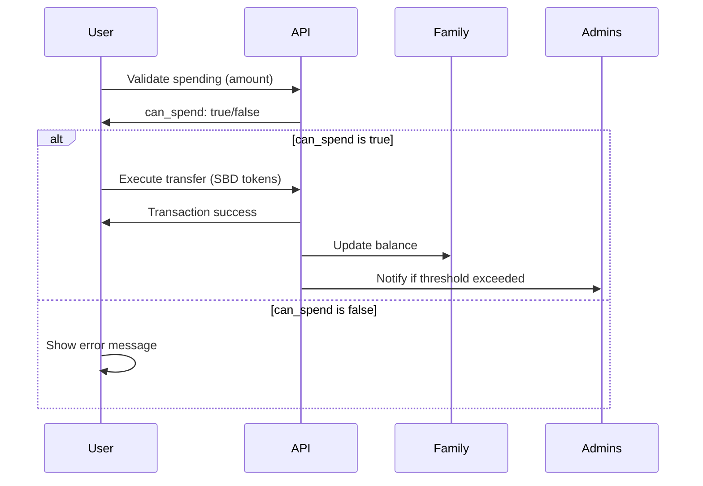
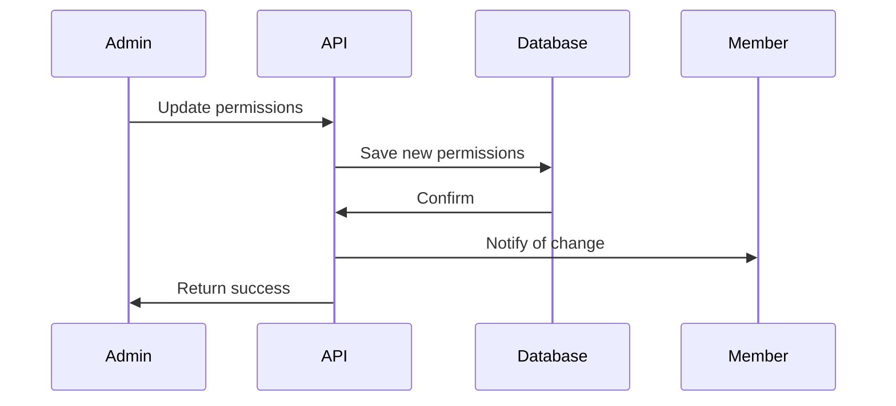
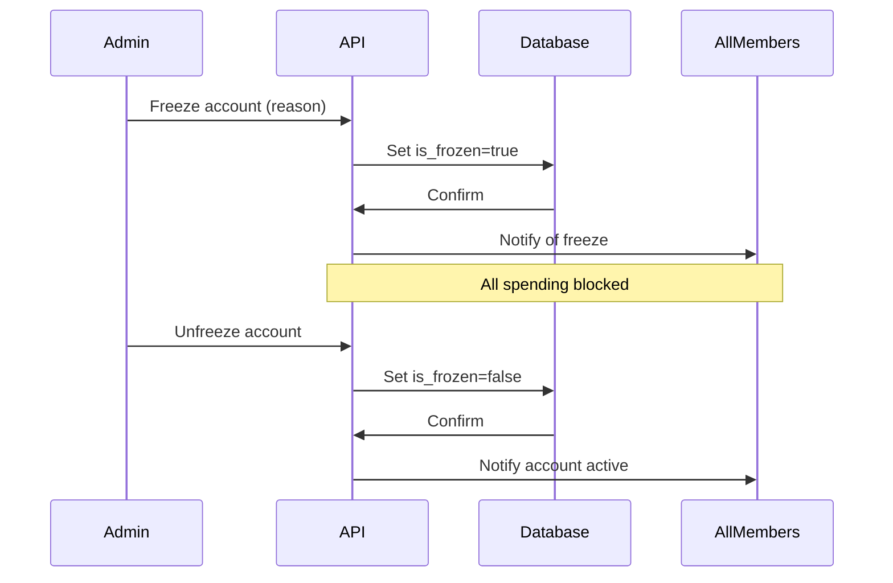

# Family SBD Wallet API - Quick Reference

Fast reference for developers integrating with the Family SBD Wallet system.

---

## Base URL

```
Production: https://api.secondbraindatabase.com
Development: http://localhost:8000
```

## Authentication

All endpoints require Bearer token authentication:

```http
Authorization: Bearer <your_jwt_token>
```

---

## Endpoints Summary

| Method | Endpoint | Purpose | Auth Level |
|--------|----------|---------|------------|
| GET | `/family/{family_id}/sbd-account` | Get account info | Member |
| PUT | `/family/{family_id}/sbd-account/permissions` | Update permissions | Admin |
| POST | `/family/{family_id}/sbd-account/freeze` | Freeze/unfreeze account | Admin |
| GET | `/family/{family_id}/sbd-account/transactions` | Get transaction history | Member |
| POST | `/family/{family_id}/sbd-account/validate-spending` | Validate spending | Member |

---

## Quick Examples

### 1. Get Account Balance

```bash
curl -X GET "https://api.example.com/family/fam_123/sbd-account" \
  -H "Authorization: Bearer YOUR_TOKEN"
```

**Response**:
```json
{
  "account_username": "family_smiths",
  "balance": 5000,
  "is_frozen": false,
  "spending_permissions": { ... },
  "recent_transactions": [ ... ]
}
```

---

### 2. Update Member Permissions

```bash
curl -X PUT "https://api.example.com/family/fam_123/sbd-account/permissions" \
  -H "Authorization: Bearer YOUR_TOKEN" \
  -H "Content-Type: application/json" \
  -d '{
    "user_id": "user_456",
    "spending_limit": 1000,
    "can_spend": true
  }'
```

---

### 3. Freeze Account

```bash
curl -X POST "https://api.example.com/family/fam_123/sbd-account/freeze" \
  -H "Authorization: Bearer YOUR_TOKEN" \
  -H "Content-Type: application/json" \
  -d '{
    "action": "freeze",
    "reason": "Suspected unauthorized access"
  }'
```

---

### 4. Validate Spending

```bash
curl -X POST "https://api.example.com/family/fam_123/sbd-account/validate-spending" \
  -H "Authorization: Bearer YOUR_TOKEN" \
  -H "Content-Type: application/json" \
  -d '{
    "amount": 500
  }'
```

**Response**:
```json
{
  "status": "success",
  "data": {
    "can_spend": true,
    "amount": 500,
    "user_permissions": {
      "spending_limit": 1000,
      "can_spend": true
    }
  }
}
```

---

### 5. Execute Spending (via SBD Token System)

```bash
curl -X POST "https://api.example.com/sbd-tokens/send" \
  -H "Authorization: Bearer YOUR_TOKEN" \
  -H "Content-Type: application/json" \
  -d '{
    "from_user": "family_smiths",
    "to_user": "merchant_xyz",
    "amount": 100,
    "note": "Groceries"
  }'
```

---

## Permission Levels

| Role | Spending Limit | Can Spend | Can Manage |
|------|----------------|-----------|------------|
| **Admin** | -1 (unlimited) | ✅ | ✅ |
| **Member (Full)** | -1 (unlimited) | ✅ | ❌ |
| **Member (Limited)** | Custom (e.g., 1000) | ✅ | ❌ |
| **Member (View Only)** | 0 | ❌ | ❌ |

---

## Error Codes

| Code | Error | Meaning |
|------|-------|---------|
| 200 | OK | Request successful |
| 400 | BAD_REQUEST | Invalid request data |
| 403 | FORBIDDEN | Insufficient permissions |
| 404 | NOT_FOUND | Family not found |
| 429 | TOO_MANY_REQUESTS | Rate limit exceeded |
| 500 | INTERNAL_ERROR | Server error |

---

## Rate Limits

| Endpoint | Limit | Window |
|----------|-------|--------|
| Get Account | 30 requests | 1 hour |
| Update Permissions | 10 requests | 1 hour |
| Freeze/Unfreeze | 5 requests | 1 hour |
| Get Transactions | 20 requests | 1 hour |
| Validate Spending | 50 requests | 1 hour |

---

## Common Workflows

### Workflow 1: Member Spends from Family Account



### Workflow 2: Admin Updates Permissions



### Workflow 3: Emergency Account Freeze



---

## Testing Snippets

### JavaScript/TypeScript

```typescript
// Validate and spend
async function familySpend(
  familyId: string, 
  amount: number, 
  recipient: string
): Promise<void> {
  // 1. Validate
  const validation = await fetch(
    `/family/${familyId}/sbd-account/validate-spending`,
    {
      method: 'POST',
      headers: {
        'Authorization': `Bearer ${token}`,
        'Content-Type': 'application/json'
      },
      body: JSON.stringify({ amount })
    }
  );
  
  const validationData = await validation.json();
  
  if (!validationData.data.can_spend) {
    throw new Error(validationData.data.denial_message);
  }
  
  // 2. Execute
  const transfer = await fetch('/sbd-tokens/send', {
    method: 'POST',
    headers: {
      'Authorization': `Bearer ${token}`,
      'Content-Type': 'application/json'
    },
    body: JSON.stringify({
      from_user: validationData.data.account_username,
      to_user: recipient,
      amount: amount
    })
  });
  
  if (!transfer.ok) {
    throw new Error('Transaction failed');
  }
}
```

### Python

```python
import requests

def family_spend(family_id: str, amount: int, recipient: str, token: str):
    """Validate and execute family spending."""
    
    # 1. Validate
    validation = requests.post(
        f"/family/{family_id}/sbd-account/validate-spending",
        headers={"Authorization": f"Bearer {token}"},
        json={"amount": amount}
    )
    
    validation_data = validation.json()
    
    if not validation_data["data"]["can_spend"]:
        raise PermissionError(validation_data["data"]["denial_message"])
    
    # 2. Execute
    transfer = requests.post(
        "/sbd-tokens/send",
        headers={"Authorization": f"Bearer {token}"},
        json={
            "from_user": validation_data["data"]["account_username"],
            "to_user": recipient,
            "amount": amount
        }
    )
    
    transfer.raise_for_status()
    return transfer.json()
```

### cURL Test Suite

```bash
#!/bin/bash

# Set variables
TOKEN="your_bearer_token"
FAMILY_ID="fam_123"
BASE_URL="http://localhost:8000"

# Test 1: Get account
echo "Test 1: Get Family Account"
curl -X GET "$BASE_URL/family/$FAMILY_ID/sbd-account" \
  -H "Authorization: Bearer $TOKEN"

# Test 2: Validate spending
echo -e "\n\nTest 2: Validate Spending"
curl -X POST "$BASE_URL/family/$FAMILY_ID/sbd-account/validate-spending" \
  -H "Authorization: Bearer $TOKEN" \
  -H "Content-Type: application/json" \
  -d '{"amount": 100}'

# Test 3: Update permissions
echo -e "\n\nTest 3: Update Permissions"
curl -X PUT "$BASE_URL/family/$FAMILY_ID/sbd-account/permissions" \
  -H "Authorization: Bearer $TOKEN" \
  -H "Content-Type: application/json" \
  -d '{
    "user_id": "user_456",
    "spending_limit": 1000,
    "can_spend": true
  }'

# Test 4: Get transactions
echo -e "\n\nTest 4: Get Transactions"
curl -X GET "$BASE_URL/family/$FAMILY_ID/sbd-account/transactions?skip=0&limit=5" \
  -H "Authorization: Bearer $TOKEN"
```

---

## Response Schemas

### SBD Account Response

```typescript
interface SBDAccountResponse {
  account_username: string;
  balance: number;
  is_frozen: boolean;
  frozen_by?: string;
  frozen_at?: string;
  spending_permissions: {
    [user_id: string]: {
      role: "admin" | "member";
      spending_limit: number;  // -1 = unlimited
      can_spend: boolean;
      updated_by: string;
      updated_at: string;
    }
  };
  notification_settings: {
    notify_on_spend: boolean;
    notify_threshold: number;
    notify_admins_only: boolean;
  };
  recent_transactions: Transaction[];
}
```

### Transaction Schema

```typescript
interface Transaction {
  type: "send" | "receive";
  to?: string;
  from?: string;
  amount: number;
  timestamp: string;
  transaction_id: string;
  family_member_id?: string;
  family_member_username?: string;
  family_id?: string;
  note?: string;
}
```

### Validation Response

```typescript
interface ValidationResponse {
  status: "success" | "error";
  data: {
    can_spend: boolean;
    amount: number;
    family_id: string;
    account_username: string;
    user_permissions: {
      spending_limit: number;
      can_spend: boolean;
      role: string;
    };
    account_status: {
      is_frozen: boolean;
      current_balance: number;
    };
    denial_reason?: "ACCOUNT_FROZEN" | "NO_SPENDING_PERMISSION" | 
                     "SPENDING_LIMIT_EXCEEDED" | "INSUFFICIENT_BALANCE";
    denial_message?: string;
  };
}
```

---

## SDK Examples (Conceptual)

### Family Wallet SDK

```typescript
class FamilyWalletSDK {
  constructor(private apiKey: string, private baseUrl: string) {}
  
  async getAccount(familyId: string): Promise<SBDAccountResponse> {
    const response = await fetch(`${this.baseUrl}/family/${familyId}/sbd-account`, {
      headers: { 'Authorization': `Bearer ${this.apiKey}` }
    });
    return response.json();
  }
  
  async validateSpending(familyId: string, amount: number): Promise<boolean> {
    const response = await fetch(
      `${this.baseUrl}/family/${familyId}/sbd-account/validate-spending`,
      {
        method: 'POST',
        headers: {
          'Authorization': `Bearer ${this.apiKey}`,
          'Content-Type': 'application/json'
        },
        body: JSON.stringify({ amount })
      }
    );
    
    const data = await response.json();
    return data.data.can_spend;
  }
  
  async spend(
    familyId: string, 
    amount: number, 
    recipient: string, 
    note?: string
  ): Promise<Transaction> {
    // Validate first
    const canSpend = await this.validateSpending(familyId, amount);
    if (!canSpend) {
      throw new Error('Spending not allowed');
    }
    
    // Get account info
    const account = await this.getAccount(familyId);
    
    // Execute transfer
    const response = await fetch(`${this.baseUrl}/sbd-tokens/send`, {
      method: 'POST',
      headers: {
        'Authorization': `Bearer ${this.apiKey}`,
        'Content-Type': 'application/json'
      },
      body: JSON.stringify({
        from_user: account.account_username,
        to_user: recipient,
        amount,
        note
      })
    });
    
    return response.json();
  }
}

// Usage
const wallet = new FamilyWalletSDK('your-api-key', 'https://api.example.com');
const account = await wallet.getAccount('fam_123');
console.log(`Balance: ${account.balance}`);

// Spend with automatic validation
await wallet.spend('fam_123', 100, 'merchant_xyz', 'Groceries');
```

---

## Support

- **Documentation**: `/docs/family_sbd_wallet_comprehensive_guide.md`
- **Edge Cases**: `/docs/family_sbd_wallet_edge_cases_fixes.md`
- **API Reference**: This document

For issues or questions, refer to the comprehensive documentation or contact the development team.
