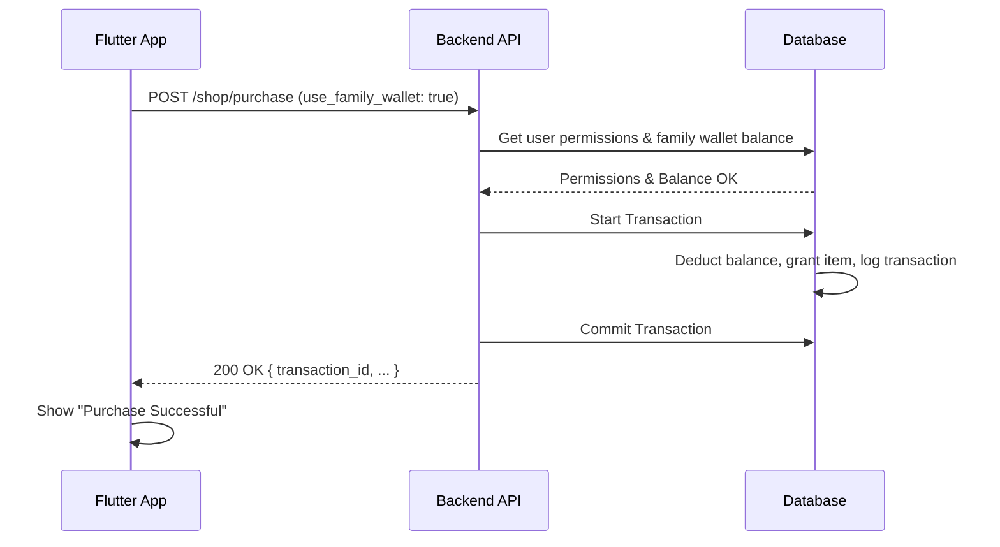
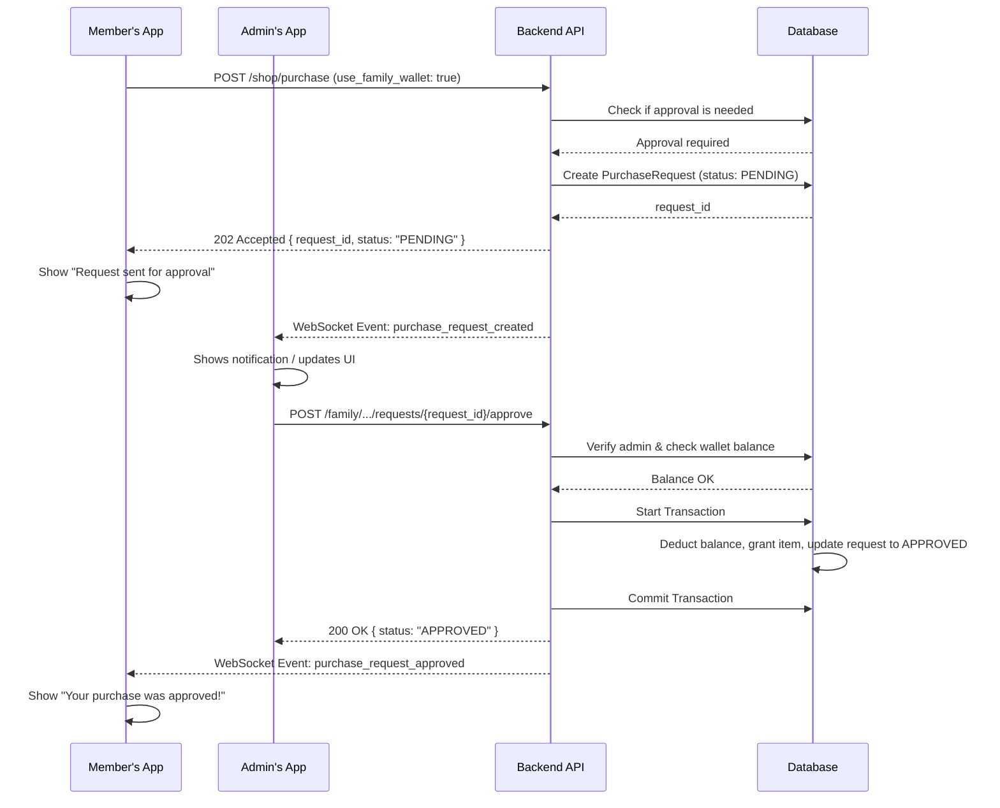

# Production-Ready Guide: Flutter Shop & Family Wallet Integration

**Author**: Gemini
**Date**: October 23, 2025
**Status**: Production Implementation Guide

## 1. Overview for Flutter Team

This document provides a comprehensive guide for the Flutter development team to implement the Shop and Family Wallet integration. It includes detailed API contracts, Dart code examples, state management strategies, real-time update patterns, and error handling.

### 1.1. Core User Stories

-   **As a family member**, I want to purchase items from the shop using our shared family wallet, so I don't have to use my personal funds.
-   **As a family member**, if my purchase requires approval, I want to be notified when it is approved or denied, so I know the outcome.
-   **As a family admin**, I want to be notified when a family member requests a purchase, so I can review it.
-   **As a family admin**, I want to approve or deny purchase requests, so I can control family spending.

---

## 2. Detailed API Contracts

All endpoints expect `Authorization: Bearer <token>` and `Content-Type: application/json`.

### 2.1. `POST /shop/purchase`

Initiates a purchase. The response determines the next step in the UI.

**Request Body:**
```typescript
interface ShopPurchaseRequest {
  item_id: string;
  quantity: number;
  use_family_wallet: true;
}
```

**Success Responses:**

-   **`200 OK` (Direct Purchase)**: The purchase was processed immediately.
    ```typescript
    interface ShopPurchaseSuccess {
      transaction_id: string;
      item_id: string;
      quantity: number;
      total_cost: number;
      family_wallet_balance_after: number;
    }
    ```

-   **`202 Accepted` (Approval Required)**: The purchase is now pending admin approval.
    ```typescript
    interface ShopPurchasePending {
      request_id: string;
      item_id: string;
      status: "PENDING";
      message: string; // e.g., "Your purchase is pending approval from a family admin."
    }
    ```

### 2.2. `GET /family/wallet/purchase-requests`

Fetches a list of purchase requests. Admins see all family requests; members see only their own.

**Query Parameters:**
- `status?: "PENDING" | "APPROVED" | "DENIED"` (optional, defaults to all)
- `limit?: number` (optional, defaults to 20)
- `offset?: number` (optional, defaults to 0)

**Response Body `200 OK`:**
```typescript
interface PurchaseRequestList {
  requests: PurchaseRequest[];
}

interface PurchaseRequest {
  request_id: string;
  requester: {
    user_id: string;
    username: string;
  };
  item: {
    item_id: string;
    name: string;
    image_url: string;
  };
  cost: number;
  status: "PENDING" | "APPROVED" | "DENIED";
  created_at: string; // ISO 8601
  reviewed_by?: {
    user_id: string;
    username: string;
  };
  reviewed_at?: string; // ISO 8601
}
```

### 2.3. `POST /family/wallet/purchase-requests/{request_id}/approve`

Approves a request. Admin only.

**Response Body `200 OK`:**
```typescript
interface ApprovalSuccess {
  request_id: string;
  status: "APPROVED";
  transaction_id: string;
}
```

### 2.4. `POST /family/wallet/purchase-requests/{request_id}/deny`

Denies a request. Admin only.

**Request Body:**
```typescript
interface DenyRequest {
  reason?: string; // Optional reason for denial
}
```

**Response Body `200 OK`:**
```typescript
interface DenialSuccess {
  request_id: string;
  status: "DENIED";
}
```

---

## 3. Flutter Integration Guide

This section provides concrete Dart code and patterns for the Flutter app. We recommend using `riverpod` for state management and `dio` for HTTP requests.

### 3.1. Dart Models (data classes)

Create these models to map to the API responses.

```dart
// In: lib/src/features/family_shop/data/purchase_request_model.dart
import 'package:freezed_annotation/freezed_annotation.dart';

part 'purchase_request_model.freezed.dart';
part 'purchase_request_model.g.dart';

@freezed
class PurchaseRequest with _$PurchaseRequest {
  const factory PurchaseRequest({
    required String requestId,
    required UserInfo requester,
    required ItemInfo item,
    required int cost,
    required String status,
    required DateTime createdAt,
    UserInfo? reviewedBy,
    DateTime? reviewedAt,
  }) = _PurchaseRequest;

  factory PurchaseRequest.fromJson(Map<String, dynamic> json) => _$PurchaseRequestFromJson(json);
}

@freezed
class UserInfo with _$UserInfo {
  const factory UserInfo({required String userId, required String username}) = _UserInfo;
  factory UserInfo.fromJson(Map<String, dynamic> json) => _$UserInfoFromJson(json);
}

@freezed
class ItemInfo with _$ItemInfo {
  const factory ItemInfo({required String itemId, required String name, String? imageUrl}) = _ItemInfo;
  factory ItemInfo.fromJson(Map<String, dynamic> json) => _$ItemInfoFromJson(json);
}
```

### 3.2. API Service with Dio and Riverpod

```dart
// In: lib/src/features/family_shop/data/family_shop_api_service.dart
import 'package:dio/dio.dart';
import 'package:riverpod_annotation/riverpod_annotation.dart';

// Assume dioProvider is defined elsewhere, configured with base URL and auth interceptor
final familyShopApiServiceProvider = Provider<FamilyShopApiService>((ref) {
  return FamilyShopApiService(ref.watch(dioProvider));
});

class FamilyShopApiService {
  FamilyShopApiService(this._dio);
  final Dio _dio;

  Future<dynamic> purchaseItem(String itemId) async {
    final response = await _dio.post('/shop/purchase', data: {
      'item_id': itemId,
      'quantity': 1,
      'use_family_wallet': true,
    });
    return response.data; // Can be a success or pending model
  }

  Future<List<PurchaseRequest>> getPurchaseRequests({String? status}) async {
    final response = await _dio.get('/family/wallet/purchase-requests', queryParameters: {'status': status});
    return (response.data['requests'] as List)
        .map((json) => PurchaseRequest.fromJson(json))
        .toList();
  }

  Future<void> approveRequest(String requestId) async {
    await _dio.post('/family/wallet/purchase-requests/$requestId/approve');
  }

  Future<void> denyRequest(String requestId, {String? reason}) async {
    await _dio.post('/family/wallet/purchase-requests/$requestId/deny', data: {'reason': reason});
  }
}
```

### 3.3. State Management with Riverpod

Manage the list of purchase requests.

```dart
// In: lib/src/features/family_shop/application/purchase_request_provider.dart
import 'package:riverpod_annotation/riverpod_annotation.dart';

// Provider for pending requests, auto-refreshes
@riverpod
Future<List<PurchaseRequest>> pendingPurchaseRequests(PendingPurchaseRequestsRef ref) {
  final apiService = ref.watch(familyShopApiServiceProvider);
  return apiService.getPurchaseRequests(status: "PENDING");
}

// Provider to manage the full list and allow filtering
@riverpod
class PurchaseRequestNotifier extends AsyncNotifier<List<PurchaseRequest>> {
  @override
  Future<List<PurchaseRequest>> build() async {
    return _fetchRequests();
  }

  Future<List<PurchaseRequest>> _fetchRequests({String? status}) {
    return ref.read(familyShopApiServiceProvider).getPurchaseRequests(status: status);
  }

  Future<void> filterByStatus(String? status) async {
    state = const AsyncValue.loading();
    state = await AsyncValue.guard(() => _fetchRequests(status: status));
  }
  
  // Call this from WebSocket handler to refresh data
  void refresh() {
    ref.invalidateSelf();
  }
}
```

### 3.4. UI/UX Flow

1.  **Shop Item Screen**:
    -   Add a `Pay with Family Wallet` button.
    -   On tap, call `ref.read(familyShopApiServiceProvider).purchaseItem(itemId)`.
    -   Show a loading indicator.
    -   On success:
        -   If `200 OK`, show a success dialog: "Purchase Complete!".
        -   If `202 Accepted`, show an info dialog: "Your request has been sent for approval."
    -   On error, show an error dialog (see Error Handling section).

2.  **Family Admin Dashboard / Notifications**:
    -   Admins receive a push notification or see a badge in the app.
    -   A new screen, `PurchaseRequestsScreen`, lists pending requests fetched via the `pendingPurchaseRequestsProvider`.
    -   Each list item shows `requester.username`, `item.name`, and `cost`.
    -   Each item has `Approve` and `Deny` buttons.

3.  **Purchase Request Screen (`PurchaseRequestsScreen.dart`)**:
    -   Use a `ConsumerWidget` to watch the provider: `ref.watch(purchaseRequestNotifierProvider)`.
    -   Display a `ListView` of requests.
    -   `Approve` button calls `ref.read(familyShopApiServiceProvider).approveRequest(request.requestId)` and then `ref.read(purchaseRequestNotifierProvider.notifier).refresh()`.
    -   `Deny` button calls the `denyRequest` method and refreshes.

---

## 4. Real-time Updates with WebSockets

To ensure the UI updates instantly, the Flutter app must connect to a WebSocket endpoint.

**WebSocket Endpoint**: `wss://api.example.com/ws/{familyId}`

### 4.1. WebSocket Events (Server to Client)

The client should listen for these events:

-   **`purchase_request_created`**: A new request has been submitted. (For Admins)
    ```json
    {
      "event": "purchase_request_created",
      "data": { ...PurchaseRequest... }
    }
    ```
-   **`purchase_request_approved`**: A request was approved. (For Requester)
    ```json
    {
      "event": "purchase_request_approved",
      "data": { "request_id": "...", "item_name": "..." }
    }
    ```
-   **`purchase_request_denied`**: A request was denied. (For Requester)
    ```json
    {
      "event": "purchase_request_denied",
      "data": { "request_id": "...", "item_name": "...", "reason": "..." }
    }
    ```

### 4.2. Flutter WebSocket Client Example

```dart
// In: lib/src/core/services/family_websocket_service.dart
import 'package:web_socket_channel/web_socket_channel.dart';
import 'package:riverpod/riverpod.dart';

class FamilyWebSocketService {
  final WebSocketChannel channel;
  final WidgetRef ref;

  FamilyWebSocketService(this.channel, this.ref) {
    channel.stream.listen((message) {
      final event = jsonDecode(message);
      switch (event['event']) {
        case 'purchase_request_created':
        case 'purchase_request_approved':
        case 'purchase_request_denied':
          // Invalidate the provider to force a refresh of the request list
          ref.invalidate(purchaseRequestNotifierProvider);
          // Optionally, show a local notification/snackbar
          break;
      }
    });
  }
}
```

---

## 5. Comprehensive Error Handling

The API will return specific error codes in a standardized format.

**Error Response Body:**
```json
{
  "error_code": "INSUFFICIENT_FUNDS",
  "message": "The family wallet does not have enough funds to complete this purchase."
}
```

**Flutter Error Handling Logic:**
```dart
// In API service methods
try {
  // ... dio call
} on DioError catch (e) {
  if (e.response?.data != null) {
    final errorCode = e.response!.data['error_code'];
    // Map errorCode to a user-friendly message
    throw _mapErrorToException(errorCode);
  }
  rethrow;
}

// In UI layer
void _showErrorDialog(BuildContext context, String message) {
  showDialog(...);
}
```

| `error_code` | `message` | Flutter UI Action |
| :--- | :--- | :--- |
| `INSUFFICIENT_FUNDS` | "The family wallet does not have enough funds..." | Show an error dialog with the message. |
| `SPENDING_LIMIT_EXCEEDED` | "This purchase exceeds your spending limit of X SBD." | Show an error dialog with the message. |
| `SPENDING_NOT_ALLOWED` | "You do not have permission to spend from the family wallet." | Show an error dialog. Disable the purchase button. |
| `REQUEST_NOT_PENDING` | "This request has already been reviewed." | Refresh the list and show a snackbar. |
| `INSUFFICIENT_FUNDS_ON_APPROVAL` | "Wallet balance is now too low to approve this request." | Show an error dialog to the admin. |
| `NOT_A_FAMILY_ADMIN` | "Only family admins can perform this action." | Show an error dialog. This shouldn't happen with correct UI logic. |

---

## 6. Sequence Diagrams (Mermaid)

### Direct Purchase Flow


### Approval Workflow

